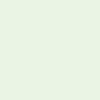
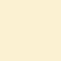

# Colors

The following colors are a subset of the [U.S. Web Design Standards](https://standards.usa.gov/components/colors/) color palette.

## Primary Colors

| | U.S Web Standard CSS class | Hex Value | Description |
| -------------------------------------------------------------------- |:-------------:| ------- |:-------------|
|  | color-gray-dark | #323a45 | Used for the header background |
|  | color-primary | #0071bc | Used for primary action buttons |
|  | color-primary-alt | #02bfe7 | Used for search buttons |
|  | color-secondary | #e31c3d | Used sparingly as a highlight |

## Background Colors

| | U.S Web Standard CSS class | Hex Value | Description |
| -------------------------------------------------------------------- |:-------------:| ------- |:-------------|
|  | color-white | #ffffff | Primary background color |
|  | color-gray-cool-light | #dce4ef | Used to distinguish required policy text from other information |
|  | color-gray-lightest| #f1f1f1 | Used as a background for complex forms with mutiple fields |

## Alert Colors

| | U.S Web Standard CSS class | Hex Value | Description |
| -------------------------------------------------------------------- |:-------------:| ------- |:-------------|
|  | color-green-lightest | #e7f4e4 | Used for success alerts |
|  | color-primary-alt-lightest | #e1f3f8 | Used for informational alerts |
|  | color-secondary-lightest | #f9dede | Used for error alerts |
|  | color-gold-lightest | #fff1d2 | Used for warning alerts |

## Text Color

## Link Color

